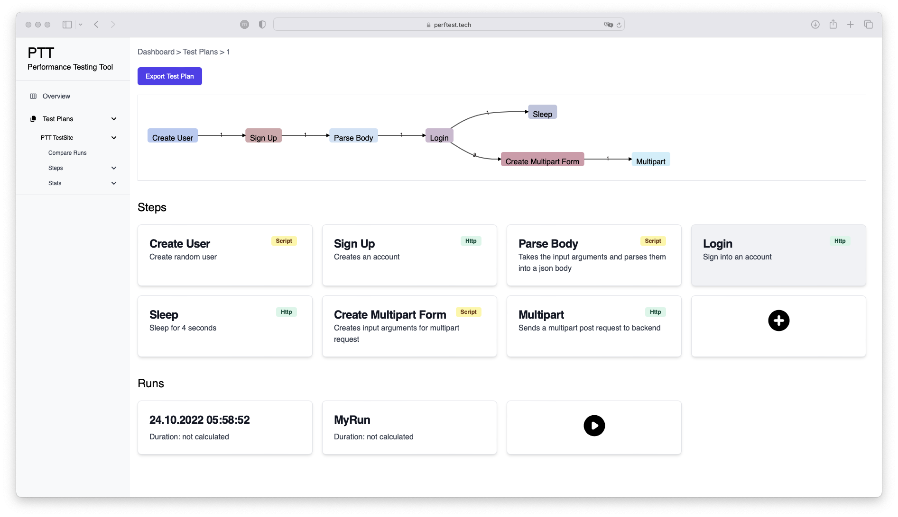
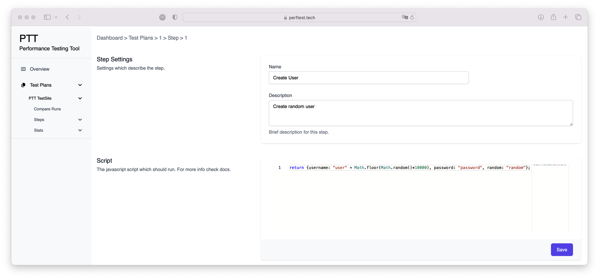
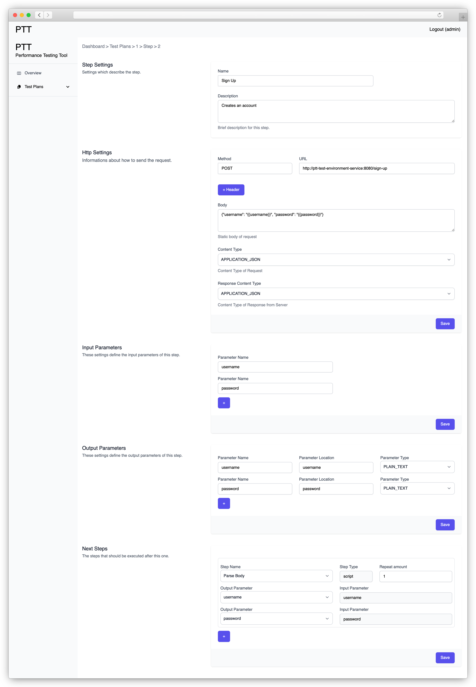
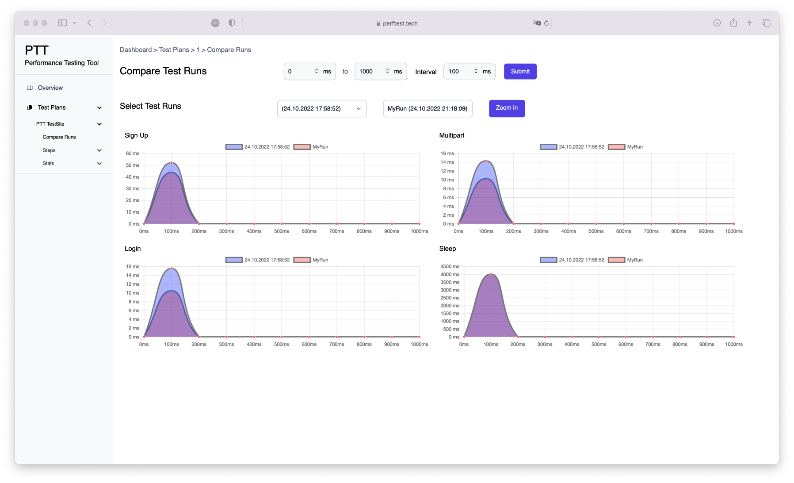

# Performance Testing Tool
The Performance Testing Tool is a Kubernetes-native web application designed for conducting load tests on HTTP servers. It offers full flexibility in configuring the scan target, HTTP requests, and the overall load to be generated. Test results are visualized through clear and intuitive graphs.

Load testing is performed by launching a configurable number of worker pods within a Kubernetes cluster. These workers send parallel HTTP requests to the target server and collect metadata such as response times for further analysis.

The Performance Testing Tool was implemented as part of our Diploma Thesis at the HTL Leonding in 2022-2023.

## How-To

To scan your web application, you first need to create a Test Plan. A Test Plan is a sequence of Steps that define how a Load Test is executed. There are two types of steps you can add:
* **HTTP Step** – Sends an HTTP request during the load test.
* **Script Step** – Executes custom JavaScript code, typically used to prepare variables (e.g., generate random data, calculate timestamps, or perform any logic that can be scripted).

Each Step can pass variables to the next one, allowing you to chain logic together. For example, a Script Step might generate a username with a random number, which is then passed to a Sign-Up HTTP Step to create a user with that name. That same username can then be reused in subsequent steps.

For a better understanding, refer to the **Screenshots** section or, ideally, deploy the application locally and try it out yourself.

> [!CAUTION]
> Use of load testing tools **is strictly prohibited without explicit permission from the system owner**. Unauthorized testing may cause service disruption and violate laws, leading to legal consequences. The developers of this tool are **not responsible** for any misuse by third parties. Always obtain **written authorization** before running any tests.

## Technology Stack

* Authentication: OIDC (Keycloak)
* Frontend: Angular with TailwindCSS
* Backend: Quarkus REST API and GraalVM Polyglott API for execution of JavaScript Scripts
* Database: PostgreSQL
* MQTT: Mosquitto
* Worker: Reactive Quarkus Web Application using Vert.x

When a load test is initiated, the backend dynamically launches a configurable number of worker instances within the Kubernetes cluster using the Kubernetes API. These workers send parallel HTTP requests to the target system and report metadata—such as response times—via an MQTT queue back to the backend. The backend stores this data in the PostgreSQL database and exposes it to the frontend through a REST API.

## Installation

To run the Performance Testing Tool, a Kubernetes cluster is required. It can be run locally by installing the following dependencies:

* Docker
* Helm
* Skaffold (tested with v1.39.4)

Additionally, ensure that Docker's built-in Kubernetes cluster is enabled.

Once the environment is set up, navigate to the project’s root directory and run the following Skaffold command to build and deploy the Performance Testing Tool locally.

```bash
skaffold dev --trigger=manual
```

Demo username: `admin`
Demo password: `admin`

With a few minor configuration changes it can be deployed on any kubernetes cluster.

## Screenshots

_Creation of a Load Test Plan_


_Creation of a Script Step for Data Generation_


_Creation of a HTTP Step for Load Testing_


_Comparing two different Load Tests_



_X-Axis: Time elapsed since the start of the load test_

_Y-Axis: Average response time of HTTP requests sent at that moment_
